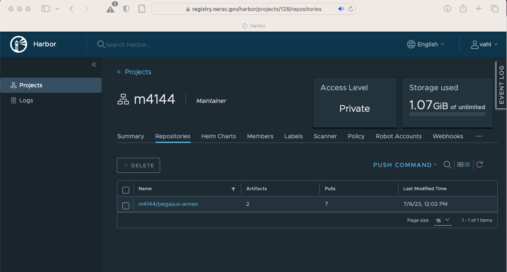
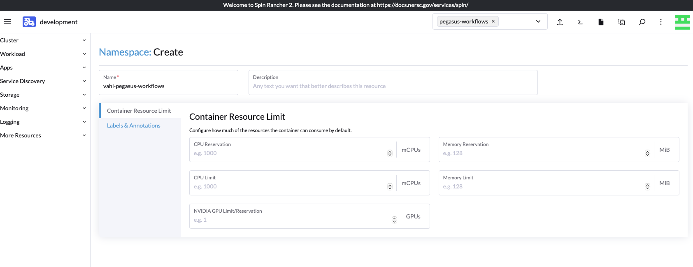
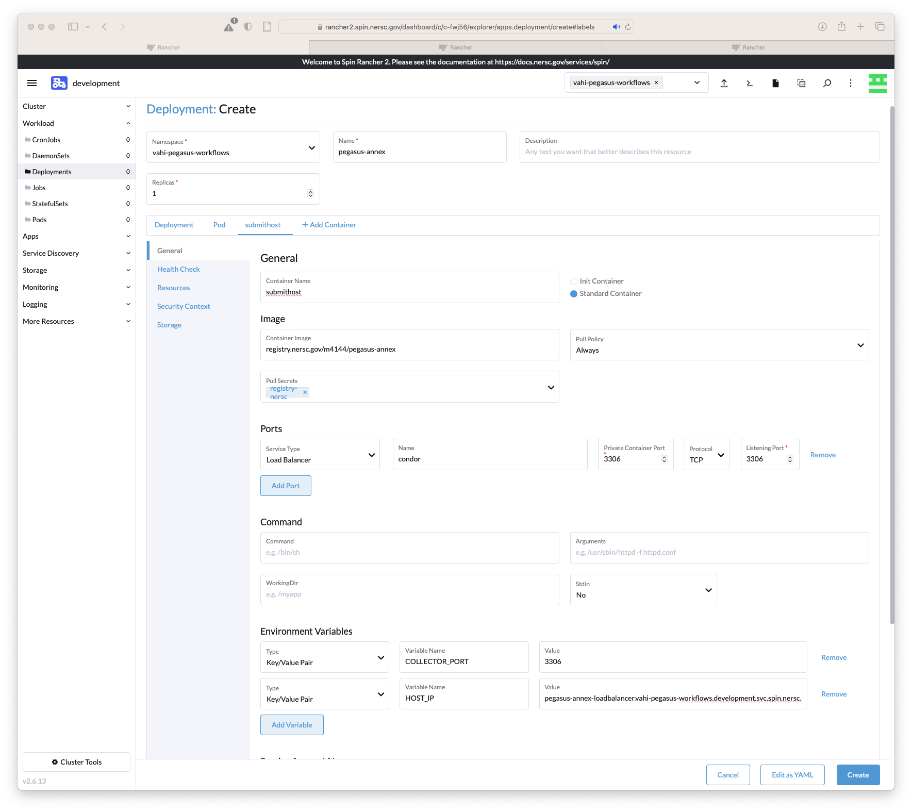
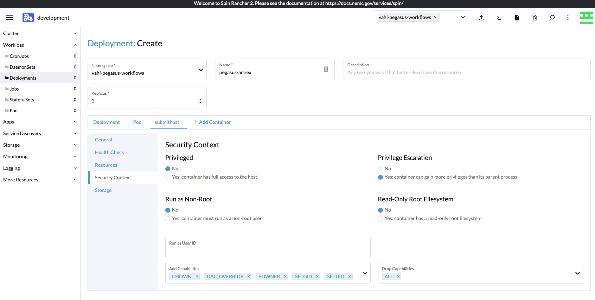

# Submitting Jobs to NERSC Perlmutter from SPIN

You can deploy this container in the SPIN cluster at NERSC, and then use it to submit Pegasus Workflows to Perlmutter. Spin is based on the Rancher orchestration system, which is built on Docker and Kubernetes.

## Before You Start

It is strongly recommended that you do the SPIN [New Users Workshop](https://www.nersc.gov/assets/Spin/SpinUp-Workshop-for-New-Users.pdf), as the deployment of this container follows the same principles.

## Accessing SPIN

The Rancher system is available at https://rancher2.spin.nersc.gov/ .

The NERSC container image registry, used in conjunction with Rancher, is available at https://registry.nersc.gov/ .

## Build and Publish Docker Container to NERSC Registry

Login to  https://registry.nersc.gov/  with your NERSC credentials, and make sure you see your NERSC project in there.
If you don't see it, contact NERSC user support at nersc@servicenowservices.com

You also need to login on the command line to be able to push your container to the registry.
Provide your nesrc username and password. Note: OTP is not required for the NERSC registry.
```
docker login registry.nersc.gov
```

To build the docker containe, you need to follow the following naming convention for building the image

registry.nersc.gov/\<myproject\>/\<myimage\>:\<mytag\>

where myproject is your NERSC project number e.g. m4144.
Replace m4144 with your nersc project in commands below

```
$ cd ..
$ docker build --tag registry.nersc.gov/m4144/pegasus-annex . 
[+] Building 149.5s (14/14) FINISHED                                                                                                                ....                                     
 => naming to naming to registry.nersc.gov/m4144/pegasus-annex 
```

Push the image out to NERSC registry
```
$ docker push registry.nersc.gov/m4144/pegasus-annex
Using default tag: latest
The push refers to repository [registry.nersc.gov/m4144/pegasus-annex]
...
```
Now if you goto your web browser and login to https://registry.nersc.gov/ you will be able to see the container in the repositories tab under your project name



## Deploy the container into Rancher

In your webbrowser go to https://rancher2.spin.nersc.gov/dashboard/auth/login and login with your NERSC username and password.

Login to the development cluster. Recommended for testing. You can also choose to deploy it in the production cluster.
The Spin user guide has useful screenshots to help navigate the Rancher UI

### Create a namespace

In the top left menu, click on Cluster and under it click on Projects/Namespaces. 
Then click on the button, Create Namespace on the right.
In the form that comes up, give the  \<nersc-username\>-pegasus-workflows as the name to the namespace.
Replace the <nersc-username> with your nersc username.



Once the namespace is created, you will see pegasus-workflows in your created namespaces. Click on it.

### Create a deployment
Then in the top left menu, click on Workload and under it click on Deployments.
Then click on the blue button, Create on the top right


The screenshot below lists the values to put

Note: You need to replace m4144 with your project number below.


The following is specified in the UI

**Name**
Set it to pegasus-annex . The workspace selected should be the one you just created e.g. <nersc-username>-pegasus-workflows

**Containers**
* Container Name - Set to *submithost*
* Container Image - Set to *registry.nersc.gov/m4144/pegasus-annex*
* Pull Policy - Set to *always*
* Pull Secrets - Set to *registry-nersc*

**Ports**
* Service Type - Set to *do not create*
* Name - Set to *condor*
* Private Container Port - Set to *3306*
* Protocol - Set to *TCP*

**Command**
Leave the default values. No need to change anything

**Environment Variables**
We add 2 environment variables
* COLLECTOR_PORT - Set to *3306*
* HOST_IP - Set to *pegasus-annex-loadbalancer.<nersc-username>-pegasus-workflows.development.svc.spin.nersc.org*

**NOTE**: Replace the <nersc-username> with your nersc username.

**Service Account Name**
Set Service Account Name to default

#### Security Context
Now you need to add the security context to your submithost container
To do that Click on Security Context Under General in the submithost container menu

You add the following capabilities to your container
* CHOWN
* DAC_OVERRIDE
* FOWNER
* SETGID
* SETUID

Under Drop Capabilities, select
* ALL

The screenshot below illustrates that


Now click the Blue Create button to create your deployment.

### Create the LoadBalancer Controller

Now we need to create the loadbalancer controller. This allows the worker nodes on Perlmutter to connect back to our submit host container on port 3306 where we are running the HTCondor Collector.

1) Under Workload, click Deployments and click your  workload; under the ⋮ menu, click Edit Config; in the header, click
submithost; in the left panel, click General. Scroll down to Ports.

2) Modify the existing port

* Service Type - Set to *Load Balancer*
* Name - Set to *condor*
* Private Container Port - Set to *3306*
* Protocol - Set to *TCP*
* Listening Port - Set to *3306*

3) Click Save

